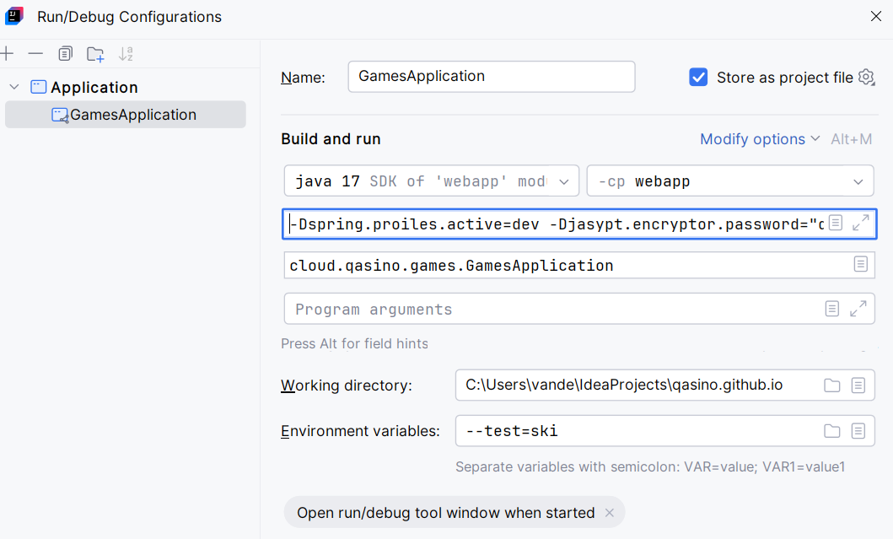

Back to [README](README.md)

### Running the application in intelij
- 'mvn spring-boot:run -Dspring.profiles.active=dev`
- Home go to: http://localhost:8080/qasinoResponse/api/home
- H2 console: http://localhost:8080/h2-console/
- Swagger springfox: http://localhost:8080/v2/api-docs
- Swagger ui: http://localhost:8080/swagger-ui/
- in intellij do
- 

-Dspring.profiles.active=dev
-Djasypt.encryptor.password=****

### Running the app in Heroku
  https://devcenter.heroku.com/articles/deploying-java

  -Dspring.profiles.active=dev


### To investigate
To make life easier use [variables] (https://graphql.org/learn/queries/#variables) in your GraphQL query.
Create a custom [Resolver] (https://www.graphql-java-kickstart.com/tools/schema-definition/#resolvers-and-data-classes).   
Add an uppercase directive to your application. The directive will uppercase any
String field you for which you've set the directive in your schema.
Please refer to [directives] (https://graphql.org/learn/queries/#directives) for more information on how
to implement them.

# Resources
### GraphQL
* [GraphQL](https://graphql.org/)
* [GraphQL documentation](https://graphql.org/learn/)
* [GraphQL Schema and Types](https://graphql.org/learn/schema/)
* [GraphQL Java](https://www.graphql-java.com/tutorials/getting-started-with-spring-boot/)
* [GraphQL Java Kickstart](https://www.graphql-java-kickstart.com/)

### Marvel
* [Developer portal](https://developer.marvel.com)
* [Interactive documentation](https://developer.marvel.com/docs)
* [Authorizing and signing requests](https://developer.marvel.com/documentation/authorization)

### Others
* [Official Apache Maven documentation](https://maven.apache.org/guides/index.html)
* [Spring Boot Maven Plugin Reference Guide](https://docs.spring.io/spring-boot/docs/2.2.1.RELEASE/maven-plugin/)

### Create a New OIDC App in Okta

To create a new OIDC app on Okta:
1. Log in to your developer account, navigate to **Applications**, and click on **Add Application**.
3. Select **Single-Page App** and click **Next**.
4. Give the application a name and click **Done**.

#### Server Configuration
Set your domain and copy the `clientId` into `server/src/main/resources/application.yml`.
**NOTE:** The value of `{yourOktaDomain}` should be something like `dev-123456.oktapreview`. Make sure you don't include `-admin` in the value!

```yaml
okta:
  oauth2:
    client-id: {yourClientId}
    issuer: https://{yourOktaDomain}/oauth2/default
```

#### Client Configuration
For the client, set the `issuer` and copy the `clientId` into `client/src/router.js`.

```js
Vue.use(Auth, {  
  issuer: 'https://{yourOktaDomain}/oauth2/default',  
  client_id: '{yourClientId}',  
  redirect_uri: window.location.origin + '/implicit/callback',  
  scope: 'openid profile email'  
});
```

## Links

This example uses the following open source libraries from Okta:

* [Okta Spring Boot Starter](https://github.com/okta/okta-spring-boot)
* [Okta Vue SDK](https://github.com/okta/okta-oidc-js/tree/master/packages/okta-vue)

## Help

Please post any questions as comments on the [blog post](https://developer.okta.com/blog/2018/11/20/build-crud-spring-and-vue), or visit our [Okta Developer Forums](https://devforum.okta.com/). You can also email developers@okta.com if would like to create a support ticket.

## License

Apache 2.0, see [LICENSE](LICENSE).