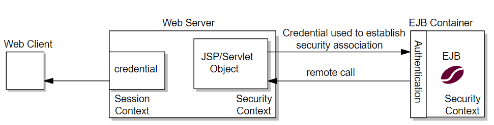
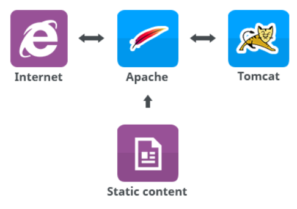

Back to [Index](0-index.md)

| What  | Url |
|-------|-----|
| httpd |     |
| ...   | ... |

## Change log

## Background
Web server = software that can accept HTTP requests and answer with files or pages
- Examples: Apache Web Server (Apache httpd) / Node.js / NGINX / Apache Tomcat 

- Application server = software that host apps eg. containers or a framework between the OS, application and dbms
- Examples: Java = Tomcat, Jetty, Glassfish / JS = Node.js, Deno / Win = .Net fw  

## Web servers
Node.js = 2009 a JavaScript runtime built on Chrome's V8 JavaScript engine
- has promises and async/await and stared with npm and later grunt, webpack etc.
NGINX = 2004 Open-source high performance Web server - async and event driven from Igor  
F5 = 1996 company that is behind the popular open source project, NGINX and has F5 BigIP suites
- Load Balancer = a device that acts as a reverse proxy and distributes network or application 
traffic across a 
number of servers
Apache (HTTP Server Project) HHTP/Web server = 1995 Open-source Web server  
- "a patchy web server" made from a series of patches, serve static content
- /etc/[apache2|httpd]/* = the folder for config files (but can also be /opt/)
- [apache2.conf|http.conf] = conf file for ProxyPassReverse and DocumentRoot settings
- .htaccess = conf file in /var/www/ that overrides http.conf for shared hosting
- ports.conf = defines on what ports Apache should listen.

## Java based App servers
Apache Tomcat = open-source web server supported by Apache for dynamic content (html, images, audio)
- Tomcat is in essence a Servlet Container that loads classes and handles threads
- Tomcat does not need webserver but a JRE which has http 
  - add a Connector port in Tomcat for that port with proxyPort 80 (or other) 

TcServer = 2009 web application server that extends Apache Tomcat
- multi instance support, indiv runtime instances share binaries
- server.xml for port and password management
Pivotal  = formerly known as VMware vFabric tc Server, Pivotal owns TcServer.

## Folder structure for web server
/etc/httpd/conf/httpd.conf and /etc/httpd/conf.d =
- Listen statement = defines the IP+port to listen to
- Open port 80 on the firewall with iptables utility as root eg <iptables -A INPUT -i eth0 -p tcp --dport 80>
- You can open port 22 also with this command
/var/www/html/index.html = data for websites you'll run with Apache - see conf
- set onwership for index.html to apache.apache with chown
- systemctl start httpd to start apache
- test with lynx localhost which should give content of index.html

 
## Actions
Extract tcserver:
- groupadd pivotal
- useradd tcserver -g pivotal
- mkdir -p /opt/pivotal/tcserver
- cd /opt/pivotal/tcserver
- copy the pivotal-tc-server-standard-4.1.12.RELEASE.tar.gz to /opt/pivotal/tcserver
- tar -zxvf pivotal-tc-server-standard-4.1.12.RELEASE.tar.gz

## Working instructions
