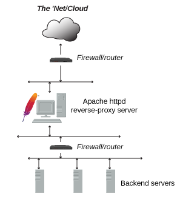

Back to [Index](0-index.md)

## Background
Gateway = reverse proxy server = in addition to being a "basic" web server, Apache httpd can act as a reverse proxy server aka 
"gateway", benefits are security, high-availability, load-balancing and centralized authentication/authorization.

For ING the gateway is NGINX = https://gateway.ing.net/get-help 
- X-ING-Response-ID = TracING id and is generated by NGINX
- peer.hostname = DNS name of called target eg pCreditcardService 
- error.functional.message = HTTP status code 
  - 502 is firewall, not running, wrong tls with health check
  - 502 is firewall when 60sec on AED Phoenix, FQDN name in AED not correct

HTTP 1.1 = 1999 HTTP is a protocol for fetching resources such as HTML documents. 
- it is the foundation of any data exchange on the Web
- it is a client-server protocol, which means requests are initiated by the recipient, usually the Web browser
TCP = 1970 is an important network protocol that lets two hosts connect and exchange data streams. 
- TCP guarantees the delivery of data and packets in the same order as they were sent.
HTTP2 = faster binary HTTP1.1 
HTTPS = HTTP with SSL/TLS, Ing uses the following protocols
- SSL on TCP range 8081-8099 for HTTPS
- SSL on TCP port 9093 for Kafka
- SSL on TCP port 30113 for TIBCO
- SSL on TCP port 9142 for Cassandra
- SSL on TCP port range 10080-10099 for Prometheus
- TCP 9200-9300 for Elastic Search
SSL = Secure Sockets Layer = use certificates with issuing authority to encrypt connections
TLS = the successor protocol to SSL, TLS 1.3 does encrypt in one round trip so

## Gateway Related Modules (apache)
mod_proxy =
mod_proxy_balancer = 
mod_proxy_hcheck = 

## Gateway Related Directives (apache)
ProxyPass =  specifies the mapping of incoming requests to the backend server
- ProxyPass "/"  "http://www.example.com/" // forward all to backend server in balancer
- ProxyPassReverse "/"  "http://www.example.com/" // modify Location: headers from backend

BalancerMember = workers = the backend server - more is a cluster
<Proxy balancer://myset>
  BalancerMember http://www2.example.com:8080
  BalancerMember http://www3.example.com:8080 loadfactor=3 timeout=1
  BalancerMember http://spare1.example.com:8080 status=+R // a failover server
  ProxySet lbmethod=bytraffic // use a load balancing algorithm that balances based on I/O bytes
</Proxy>
- ProxyPass        "/images/"  "balancer://myset/"
- ProxyPassReverse "/images/"  "balancer://myset/"

## Working instructions - change a directive and restart httpd
1. Log in to the server via SSH as the root user
## we have requested 2 machines - dcr and wpr with no dr capability from ipcloud
## when request an apache web server you specify the the pn eg DBNL_Creditcards_Acceptance
> su - root
2. List currently install modules
> apachectl -M // this is Apache HTTP Server Control Interface for managing httpd

## Working instructions - set up authentication
1. use the htpasswd utility that came with Apache
> htpasswd -c /usr/local/apache/passwd/passwords rbowen // only use -c first time
2. edit the httpd.conf file or using an .htaccess file to configure use of passwords
> AuthType Basic // use mod_ssl to encrypt as the data is send unencrypted
> AuthName "Restricted Files"
# (Following line optional)
> AuthBasicProvider file // is default file
> AuthUserFile "/usr/local/apache/passwd/passwords" // refer to above file
> Require user rbowen
3. for a lot of users switch from file to db with mod_authn_dbm
