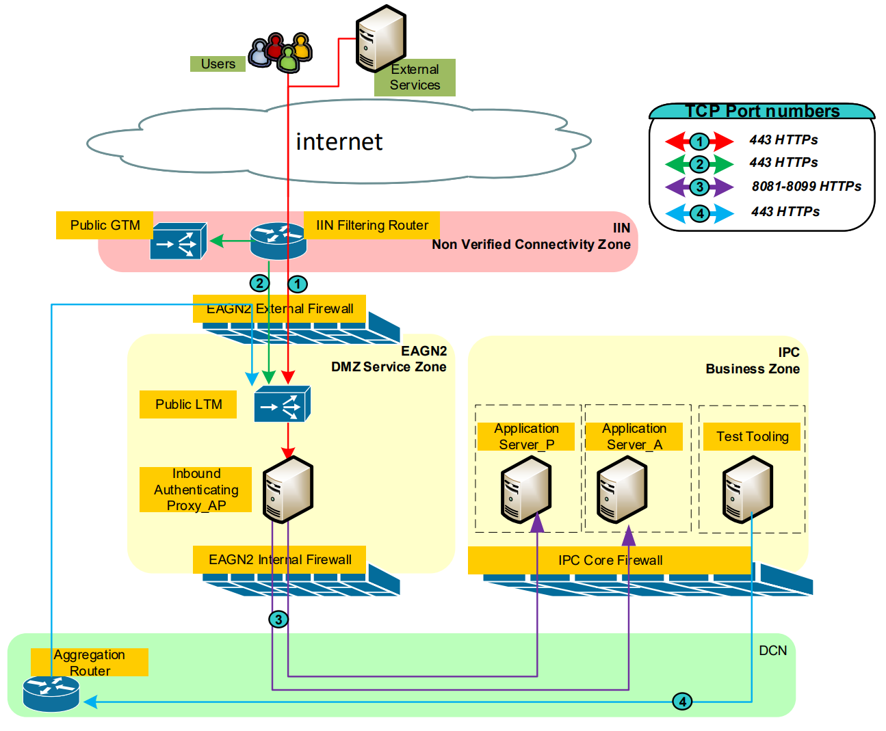

Back to [Index](0-index.md)

## Background
link = Network and Firewalls on confluence
link = Global Network Standardisation on confluence
RCEC = describes traffic wallowed on the ING network 

EIN = Ext Internfacing Network eg vendor via a leased line (VPN or XFB is also possible)
IIN = Non verified connectivity zone
EAGN2 = DMZ Service Zone - External NGinX farm
- has External Checkpoint firewalls for internet
- has Internal Checkpoint firewalls for after the authenticating proxy
- does traffic filtering, NAT, session breaking
DCM = Aggregation router
IPC = BZ = Business Zone (MZ is ManZone, SSZ = SupServZone )

VCZ = the interface network between ING, ING business partners and providers for ING. 
- This network hosts only (logical) point-to-point circuits.
F5 loadbalancer = uses healthmonitor with GET /keepalive

## Secure networking
ING wants 
- NGINX reverse proxy/gateway between internal and external networks 'Authenticating Proxy'
- Jumphosts for logon via SSH
- Citrix for Oracle or other fat clients
- GSO firewall type 

## Certificates for Authentication, Encryption and Integrity
Entrust = ING primary supplier of external certificates (IdenTrust is fallback)
public key certificates = https://en.wikipedia.org/wiki/Public_key_certificate using 
- X.509, sha256, 2048 bit key length
PKI = public key infrastructure
CN = Common Name = primary hostname or *.example.com
CA = Certificate Authority = CA acts as a trusted third party eg Entrust
JAVA Ca-cert = list of certificate authorities that are trusted by default
CSR = a certificate signing request for X.509 (aka Certificate Request) 
- a message sent from an applicant to a certificate authority of PKI 
- in order to apply for a digital identity certificate
- common format for CSRs is the PKCS#10
- can be BASE64 encoded

## ING Certificates
link = 	ING Corporate Crypto on confluence 
ING Corporate PKI = https://pki.ing.net = for Internally Trusted Certificates
ING Corporate Certificate management = www.ing.com/pki = for External / Publicly Trusted Certificates
- ING.Corporate.Crypto@ing.nl email procedure
- you should have a process design and operations for the security key transfer
- you should have operational contracts and monitoring governance
- protocol in case the key is leaked by the supplier
- Our default Organization Name is ING Groep N.V.
- Use identity card on mac or secure email on windows

## Abbreviations
MD4 = old ING NL data centers (WPR/DCR)
Business Zone = IPC - ING Private Cloud

## Working instructions 