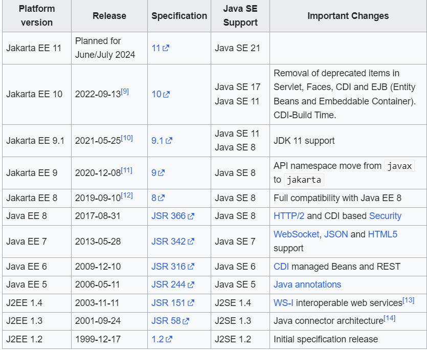

Back - [Java index](0-index.md)

# History
In the first version of Java, Java enterprise extensions were simply a part of the core JDK.
Then, as part of Java 2 in 1999, these extensions were broken out of the standard binaries, and J2EE, or Java 2 Platform Enterprise Edition, was born. It would keep that name until 2006.
For Java 5 in 2006, J2EE was renamed to Java EE or Java Platform Enterprise Edition. That name would stick all the way to September 2017, when something major happened.

_**See, in September 2017, Oracle decided to give away the rights for Java EE to the Eclipse Foundation (the language is still owned by Oracle).**_

# Jakarta EE
Actually, the Eclipse Foundation legally had to rename Java EE. That’s because Oracle has the rights over the “Java” brand.

Jakarta EE, formerly Java Platform, Enterprise Edition (Java EE) and Java 2 Platform, Enterprise Edition (J2EE), is a set of specifications, extending Java SE[1] with specifications for enterprise features such as distributed computing and web services.[2] 


# Apache HttpClient

GET
```java
CloseableHttpClient httpClient = HttpClientBuilder.create().build();
// send basic get
httpClient.execute(new HttpGet("http://www.google.com"),
    response -> {
        //handle response
        assertThat(response.getCode()).isEqualTo(200);
        String bodyAsString = EntityUtils.toString(response.getEntity());
        assertThat(bodyAsString, notNullValue());
        return response;
    }
);
```

POST
```java
ConnectionConfig connConfig = ConnectionConfig.custom()
.setConnectTimeout(timeout, TimeUnit.MILLISECONDS)
.setSocketTimeout(timeout, TimeUnit.MILLISECONDS)
.build();

RequestConfig requestConfig = RequestConfig.custom()
.setConnectionRequestTimeout(Timeout.ofMilliseconds(2000L))
.build();

BasicHttpClientConnectionManager cm = new BasicHttpClientConnectionManager();
cm.setConnectionConfig(connConfig);

CloseableHttpClient httpClient = HttpClientBuilder.create()
.setDefaultRequestConfig(requestConfig)
.setConnectionManager(cm)
.build();

httpClient.execute(new HttpPost(SAMPLE_URL),
    response -> {
        //handle response 
    }
);
```
POST with parameters to a request
```java
HttpPost httpPost = new HttpPost(SAMPLE_POST_URL);

List<NameValuePair> params = new ArrayList<NameValuePair>();
params.add(new BasicNameValuePair("key1", "value1")); 
params.add(new BasicNameValuePair("key2", "value2")); 

httpPost.setEntity(new UrlEncodedFormEntity(params);
```

# Java HttpClient API
The Java HttpClient API was introduced with Java 11. The API implements the client-side of the most recent HTTP standards. It supports HTTP/1.1 and HTTP/2, both synchronous and asynchronous programming models.
We can use it to send HTTP requests and retrieve their responses. Before Java 11, we had to rely on a rudimentary URLConnection implementation or third-party libraries such as Apache HttpClient.
HttpClient instances can be configured and created from its builder using the newBuilder method. Otherwise, if no configuration is required, we can make use of the newHttpClient utility method to create a default client:
```java
HttpClient client = HttpClient.newHttpClient();
HttpRequest request = HttpRequest.newBuilder()
        .uri(URI.create(serviceUrl))
        .POST(HttpRequest.BodyPublishers.noBody())
        .build();
```
HttpClient will use HTTP/2 by default. It will also automatically downgrade to HTTP/1.1 if the server doesn’t support HTTP/2.

### Synchronously
We can send the prepared request using this default send method. This method will block our code until the response has been received:
```java
HttpResponse<String> response = client.send(request, HttpResponse.BodyHandlers.ofString())
assertThat(response.statusCode())
        .isEqualTo(200);
assertThat(response.body())
        .isEqualTo("{\"message\":\"ok\"}");
```

### Asynchronously
We could send the same request from the previous example asynchronously using the sendAsync method. Instead of blocking our code, this method will immediately return a CompletableFuture instance:
```java
CompletableFuture<HttpResponse<String>> futureResponse = 
        client.sendAsync(request, HttpResponse.BodyHandlers.ofString());

// The CompletableFuture completes with the HttpResponse once it becomes available:
HttpResponse<String> response = futureResponse.get();
assertThat(response.statusCode()).isEqualTo(200);
assertThat(response.body()).isEqualTo("{\"message\":\"ok\"}");
```

### Concurrently
We can combine Streams with CompletableFutures in order to issue several requests concurrently and await their responses:

```java
List<CompletableFuture<HttpResponse<String>>> completableFutures = serviceUrls.stream()
  .map(URI::create)
  .map(HttpRequest::newBuilder)
  .map(builder -> builder.POST(HttpRequest.BodyPublishers.noBody()))
  .map(HttpRequest.Builder::build)
  .map(request -> client.sendAsync(request, HttpResponse.BodyHandlers.ofString()))
  .collect(Collectors.toList());

// Now, let’s wait for all the requests to be complete so that we can process their responses all at once:
CompletableFuture<List<HttpResponse<String>>> combinedFutures = CompletableFuture
        .allOf(completableFutures.toArray(new CompletableFuture[0]))
        .thenApply(future ->
                completableFutures.stream()
                        .map(CompletableFuture::join)
                        .collect(Collectors.toList()));
// As we’ve combined all the responses using the allOf and join methods, we get a new CompletableFuture that holds our responses
List<HttpResponse<String>> responses = combinedFutures.get();
responses.forEach((response) -> {
assertThat(response.statusCode()).isEqualTo(200);
assertThat(response.body()).isEqualTo("{\"message\":\"ok\"}");
});
```
