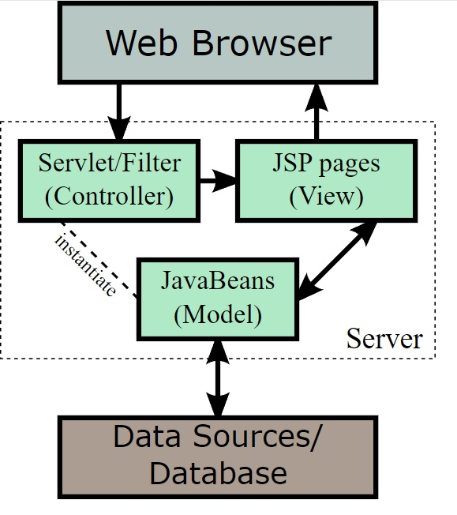
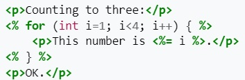

Back - [Java index](0-index.md)

# Java servlets
A Servlet is a java class that handles requests, processes them and reply with a response eg.
- collect input from a user through an HTML form (xx extends HttpServlet + @WebServlet)
- query records from a database (xx extends GenericServlet )
- create web pages dynamically

Servlets are under the control of a Servlet Container (runtime environment). A Web Server calls
the Servlet/Web Container which in turn passes it to the target Servlet.
This concept is the driver for
- JSP (JavaServer/Jakarta Pages) - html pages renamed to .jsp with <% java code %> // web.xml lists 
  them
- Spring MVC - part of Spring Boot

# JSP (JavaServer Pages / Jakarta Server Pages )
Jakarta Server Pages (JSP; formerly JavaServer Pages) is a collection of technologies that helps software developers create dynamically generated web pages based on HTML, XML, SOAP, or other document types.

Eample - Java in html -> use jsp extension

# Web containers
Web Container examples are Tomcat, Jetty, and GlassFish, a Spring container works together with
them and focuses on Spring beans and their relations (eg db connect, request mapping).
Web Server examples are Apache HTTPS, Nginx and Microsoft IIS.

# Spring Container
All the Java web frameworks are built on top of servlet api. In a web application, three files 
play a vital playerType. Usually, we chain them in order as: web.xml -> applicationContext.xml -> spring-servlet.xml.

In the Spring container, beans declared in ApplicationContext.xml.

web.xml
/WEB-INF/applicationContext.xml - central in spring boot (@SpringBootApplication creates)
-> for properties, basic data source,
spring-servlet.xml - handles incoming requests and can scan for components
-> /WEB-INF/jsp/

