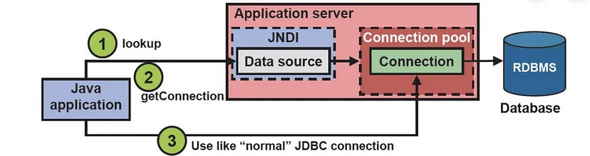
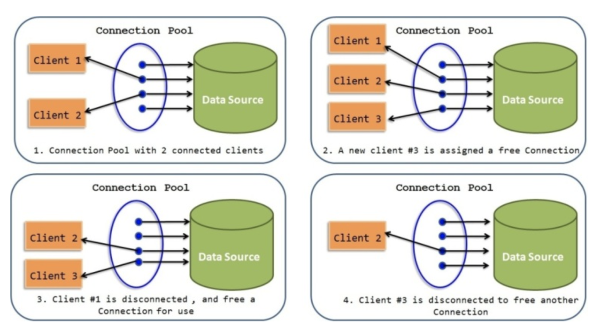
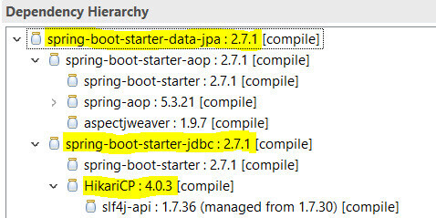
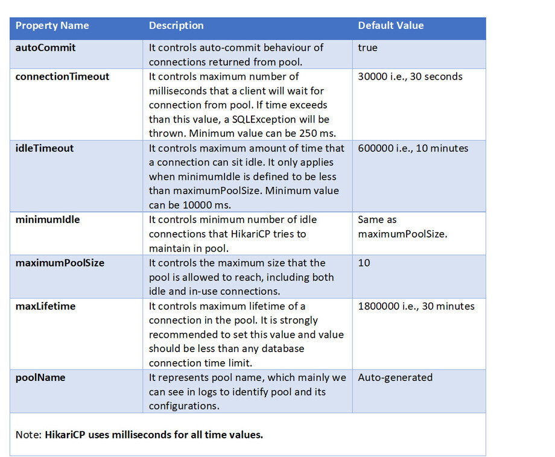

Back - [Java index](0-index.md)

# JNDI / JDBC

JNDI — Java Naming and Directory Interface API is naming service which enables components to locate other components and resources.

JDBC — Java Database Connectivity API, used to execute common SQL statements and perform other objectives common to database applications.

In a JNDI directory you’re actually storing a JDBC DataSource, so, you’re simply using JDBC to obtain a Connection via JNDI lookup.

# Connection pooling
Database Connection pooling increase performance and reduced connection creation and removal overhead due to connection reuse by the connection pool.

Java provides several popular connection pooling frameworks that you can leverage instead of building the functionality from scratch.
- Apache Commons DBCP 2: Apache Commons DBCP 2 is a widely used connection pooling framework in Java. 
- HikariCP: HikariCP is a high-performance connection pooling library and the default choice for 
  Spring Boot 2 applications.
- C3P0: C3P0 is another widely used connection pooling library for Java applications.

# Hikari
The default connection pool in Spring Boot 2 application is HikariCP that means we no need to explicitly add the dependency in the pom.xml for hikariCP.

If we use the spring-boot-starter-jdbc or spring-boot-starter-data-jpa “starters”, we automatically get the dependency to HikariCP.

