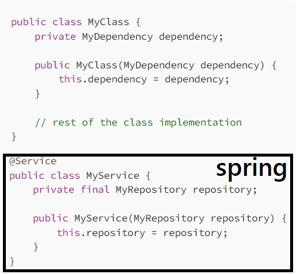
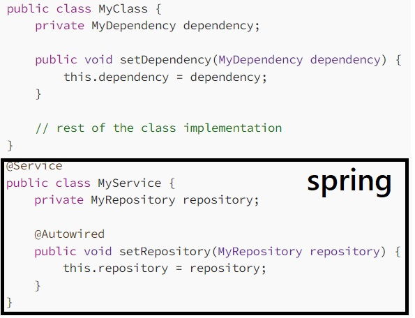
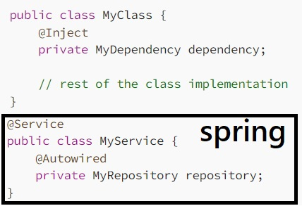
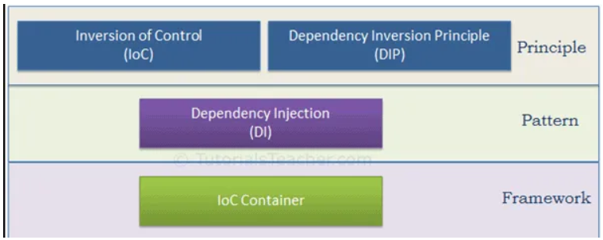

Back to [Index](0-index.md)

# Java web frameworks
1. Spring - Spring MVC Framework follows the MVC pattern
2. Grails - based on the MVC design pattern
3. Google Web Toolkit (GWT) - converts Java code into JavaScript
4. Struts - can be easily integrated with Spring
5. JavaServer Faces (JSF) - instead of using Java, JSF uses XML for view handling 

# Java other frameworks
1. Hibernate - Object-relational mapping framework for a better database communication
2. ** JHipster - Web apps and microservices with Spring Boot and Angular/React/Vue
3. MyBatis - a persistence framework for Java - links Java methods to SQL statements
4. Play - build lightweight and web-friendly Scala applications for desktop and mobile
5. Spark Framework - helps you with developing Java-based web applications, microservices, and REST APIs
6. Thymeleaf - Thymeleaf - a modern server-side Java template engine framework for both web and standalone environments.

## DI = Dependency injection / inversion principle
A technique where objects or functions receive other objects or services that is requires instead of creating them internally. 
This dminishes the inmportance of the new keyword. An injector, container introduces services to the client and the framework handles that.
In Java, there are three main types of dependency injection:

1. Constructor Injection

2. Setter Injection

3. Field Injection

Note that in all three examples, Spring Boot uses the @Autowired annotation to indicate that the dependency should be injected at runtime. Additionally, Spring Boot provides a variety of other annotations that can be used to further control the dependency injection process, such as @Qualifier and @Value.

## ICO Containers
The Spring container uses DI to manage the components that make up an application.

There are two types of IoC containers. They are:
- BeanFactory – in org.springframework.beans.factory package, use "@Bean"
- ApplicationContext – in org.springframework.context package, use "@Autowired"

The BeanFactory (https://www.baeldung.com/spring-factorybean) is a basic IoC container that 
provides basic features such as bean 
instantiation and dependency injection. The ApplicationContext is a more advanced IoC container that builds on top of the BeanFactory and provides additional features such as event publishing, messaging, and internationalization.
A container will create the objects, wire them together, configure them, and manage their 
complete life cycle from creation till destruction. 

## Beans
Java configuration typically uses @Bean-annotated methods within a @Configuration class. The @Bean annotation on a method indicates that the method creates a Spring bean. Moreover, a class annotated with @Configuration
indicates that it contains Spring bean configurations.
https://www.baeldung.com/spring-application-context

Objects created by a container are called managed objects or beans. The spring container detects beans with annotations on the configuration classes.
BeanFactory loads beans on-demand, while ApplicationContext loads all beans at startup.

Beans have 5 scopes:

common beans with ApplicationContext:
1. Singleton (default scope) - you always get the same bean
2. Prototype - you will get a new instance of the spring bean 

3. for web aware applications with WebApplicationContext:
3. Request - each http request has its own bean
4. Session - each session has its own bean
5. Global-session

