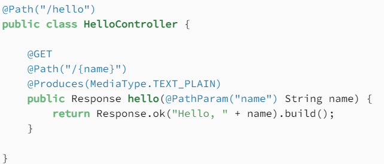
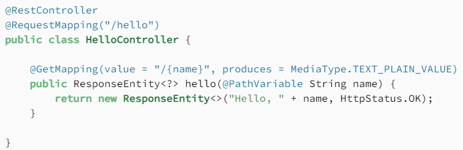

Back to [Index](0-index.md)

## Jakarta EE specification (JAX-RS)
Jakarta RESTful web services is a specification that provides support for creating web services with REST architecture: a uniform interface using HHTP based methods and URI's (web adresses). It has annotations like @Path, @GET, @Consumes, @Produces and @?Param (Path, Query, Header). 
Known implementations are:
- **Jersey** from Oracle for json integrating
- RESTeasy
- Apache CXF, WebSphere IBM,

## Jersey vs Spring

1. @QueryParam is a JAX-RS framework annotation and @RequestParam is from Spring

@QueryParam is a JAX-RS framework annotation and @RequestParam is from Spring
Take for example @RequestParam vs @QueryParam - @RequestParam will always expect a value to bind. Hence, if value is not passed, it will give error. This is not the case in @QueryParam
To explicitly give the option, use required = false while using @RequestParam

## Jersey
JAX-RS is an specification and Jersey is a JAX-RS implementation. This can be understood relating it to OOPS principles JAX-RS is an Interface and Jersey is a class implementing that interface.
Further, Java also have specification like JPA(Java Persistence API) and like mentioned above there is Hibernate which is an implementation of JPA.

## Spring (now 6.0) framework
The Spring programming model does not embrace the Jakarta EE platform specification; rather, it integrates with carefully selected individual specifications from the traditional EE umbrella: Servlet 5/6.0, JPA 3.0/1 etc which have the Jakara namespace. In spring you use @Bean, @Service, @Repository, @Configuration, @Controller, @RequestMapping, @Autowired, @Component, @SpringBootApplication, @EnableAutoConfiguration.

