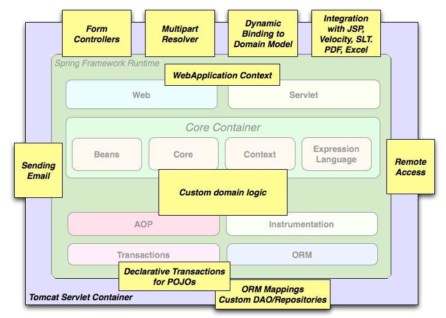

Back to [Index](0-index.md)

# Spring boot (web app)
Spring Boot is basically an extension of the Spring framework, which eliminates the boilerplate configurations required for setting up a Spring. It has a starter and embedded server and automatic config for spring functions.

Using 3rd party

# Spring MVC
Spring MVC Framework follows the Model-View-Controller design pattern which works around the Front Controller i.e. the Dispatcher Servlet.

The view is represented by any of the various template engines eg. Thymeleaf, Groovy, FreeMarker,
  Jade.

## Versions

- Springboot 2
- springboot 3

