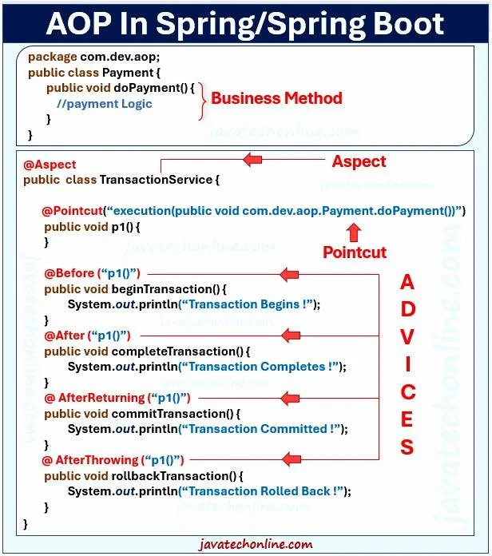

Back to [Index](0-index.md)

# Aspect Oriented Programming
Aspect-Oriented Programming (AOP) is a powerful paradigm that complements the traditional Object-Oriented Programming (OOP) approach. 
It allows developers to address cross-cutting concerns in their applications more efficiently.

# Key Concepts in Spring AOP
Before diving into examples, let’s explore some key concepts in Spring AOP:

**Aspect**: 
In Aspect-Oriented Programming (AOP), an “aspect” is a module or a unit of code that encapsulates a specific concern or behavior that cuts across multiple parts of an application. Aspects address what is often referred to as “cross-cutting concerns.” These are concerns that affect various parts of a program but aren’t the primary focus of any single part.
In simpler terms, consider aspects as reusable code components that can be applied to different parts of your application to add specific functionality or behavior without altering the core logic of those parts. In Spring AOP, aspects are defined using regular Java classes.

**Advice**: 
Advice is the action taken by an aspect at a particular join point. Common types of advice include “before,” “after,” and “around” advice.

**Join Point**: 
A join point is a specific point in the execution of your application, such as a method invocation.

**Pointcut**: 
A pointcut is a set of one or more join points where advice should be executed. It defines the criteria for selecting join points.

**Weaving**: 
Weaving is the process of integrating aspects with the main application code at compile-time, load-time, or runtime.