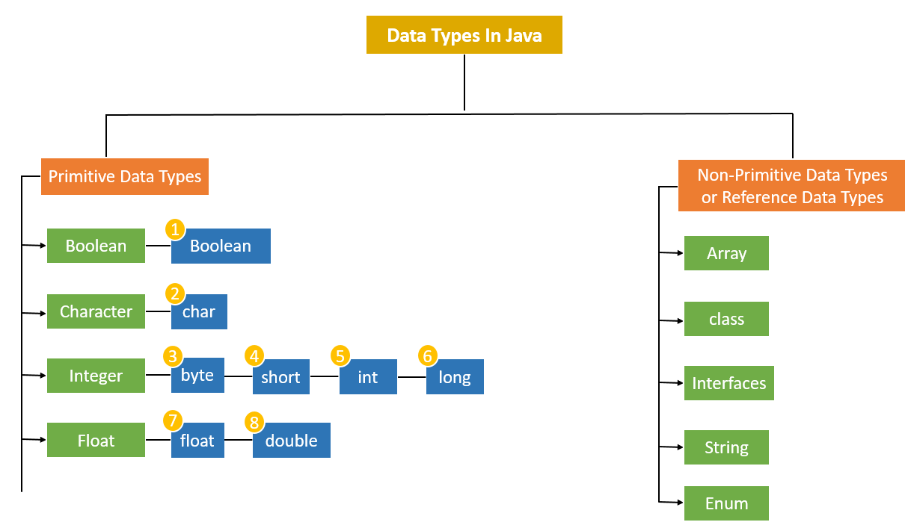
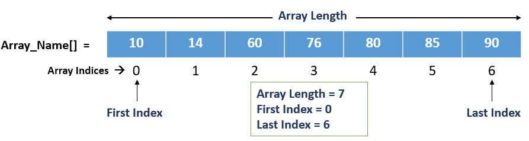

Back to [Index](0-index.md)
# Optional
## Java 8 - Datatypes


```java
float f = 65.20298f; // max 7-digit precision, ‘f’ or ‘F’, default = 0.0f
double d = 876.765d; // precision is twice the float
long l = 125362133223l;
```

## Arrays

```java
// arrays => String[] is similar to this - has fixed size.
int[] ints1 = new int[3]; ints1[2] = 23; // Arrays.toString() [0, 0, 23]
int[] ints2 = {0,0,23}; // Arrays.toString() [0, 0, 23]

// resizable array
ArrayList<String> cars = new ArrayList<String>(); 
cars.add("Volvo"); cars.add("Audi"); cars.set(0, "BMW"); // directly prints [BMW] 

int[][] myNumbers = { {1, 2, 3, 4}, {5, 6, 7} };
myNumbers[1][2] = 9;
System.out.println(myNumbers[1][2]); // Outputs 9 instead of 7

for (int[] row : myNumbers) {
        for (int i : row) {
        System.out.println(i);
  }
}
```


