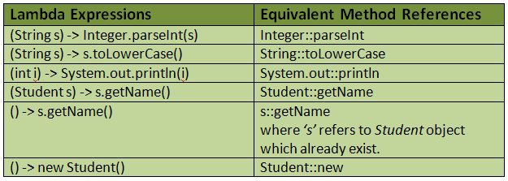

Back to [Index](0-index.md)
# Lambda
## Java 8 - Lambda
A lambda expression is a short block of code which takes in parameters and returns a value. Lambda expressions are similar to methods, but they do not need a name and they can be implemented right in the body of a method.
```java
parameter -> expression OR
(parameter1, parameter2) -> expression OR
(parameter1, parameter2) -> { code block }
        
() → System.out.println(“Hello world from lambda”);
 ```

### Example
```java
```

### Method reference 
Java 8 method references can be defined as shortened versions of lambda expressions calling a specific method. Method references are the easiest way to refer a method than the lambdas calling a specific method. Method references will enhance the readability of your code.

ClassName::MethodName // for static methods
ReferenceVariable::MethodName // for instance method of existing object
ClassName::MethodName // for reference to instance method of non-existing object
ClassName::new //  contructor reference

```java

```