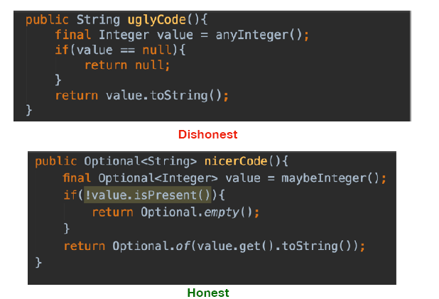
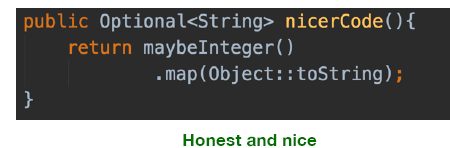

Back to [Index](0-index.md)
# Optional
## Java 8 - Optional
Optional is a concept indicating that a certain entity or object may or may not have a value. Optional should not be used in the hope of getting rid of errors like NPE.
But in case of Optional, when they are calling Optional.get(), you know what they're doing.

(Being Explicit is a good thing)
```java
Optional<User> findUserById(String userId) { ... };
```
By returning Optional User from the function, we have made it clear to the clients of this function that there might not be a User with the given userId. Now the clients of this function are explicitly forced to handle this fact.

**return a String or value**
- .orElseGet() = potentially saving unnecessary db calls when value already present
- .get() = to retrieve a value from Optional
- 
**return a boolean**
- .isPresent() =  to check if there is a value present
- .isEmpty() = use with .ofNullable() to check for null giving 'true'
- **.isEmpty() = use with .of() still gives NPE !!**

**return an Optional<String>** 
- .map() = use to Optional User to an Optional String
eg. map(user -> user.getFirstName())

Dont mix and match .map() with .orElse..
### Example

```java
public static Optional<User> findUserByName(String name) {
    User user = usersByName.get(name);
    Optional<User> opt = Optional.ofNullable(user)
        .map(<doSomething>)
        .orElse("Default value in case of null");
    //  .orElseGet(() -> getNameFromDatabase());
    //  .orElseThrow(()-> new IllegalStateException("Value is empty")));
    return opt;
}

public static void changeUserName(String oldFirstName, String newFirstName) {
    findUserByFirstName(oldFirstName)
        .ifPresent(user -> user.setFirstName(newFirstName));
    //  .ifPresent((user)->System.out.println(user)); 
}
```
### Optional.of, Optional.ofNullable
Main difference b/w Optional.of and Optional.ofNullable is that if the element wrapped under Optional is null, 
- Optional.of will raise **Null pointer exception** and will stop further processing -> to fast fail bad coding, 
- Optional.ofNullable will just **ignore null** element/object and returns Optional.empty() or NoSuchElementPresent -> for external values you have no control over
```java
Optional<String> text = Optional.of(null); // will give null pointer
Optional<String> text = Optional.ofNullable(null); // NO null pointer
```
### .map() or .filter() on Address from getAddress()
In the below example, map() method returns an empty Optional in the following cases -
- user is absent in userOptional.
- user is present but getAdderess() returns null.
otherwise, it returns an Optional<Address> containing user’s address.

```java
// Extract User's address using map() method.
Optional<Address> addressOptional = userOptional.map(User::getAddress)

// filter address from India
Optional<Address> indianAddressOptional = addressOptional.filter(address -> address.getCountry().equalsIgnoreCase("India"));

// Print, if country is India
indianAddressOptional.ifPresent(() -> {
    System.out.println("User belongs to India");
});
```
In onw single command this is
```java
userOptional.map(User::getAddress)
    .filter(address -> address.getCountry().equalsIgnoreCase("India"))
    .ifPresent(() -> {
        System.out.println("User belongs to India");
});
```
### .flatmap() on Address from getAddress() to prevent ```Optional<Optional<Address>>```
Let’s consider the above map() example again. You might ask that if user’s address can be null then why the heck aren’t you returning 
an ```Optional<Address>``` instead of plain Address from getAddress() method?
And, You’re right! Let’s correct that, let’s now assume that getAddress() returns ```Optional<Address>```. Do you think that above code will still work?

The answer is no! The problem is the following line -
```java
Optional<Address> addressOptional = userOptional.map(User::getAddress)
// Since getAddress() returns Optional<Address>, the return type of userOptional.map() will be Optional<Optional<Address>>
```
```java
Optional<Optional<Address>> addressOptional = userOptional.map(User::getAddress)
// Oops! We certainly don’t want that nested Optional. Let’s use flatMap() to correct that -
```
```java
Optional<Address> addressOptional = userOptional.flatMap(User::getAddress)
// Cool! So, Rule of thumb here - if the mapping function returns an Optional, use flatMap() instead of map() to get the flattened result from your Optional
```

### Compile error - can you spot where
```java
public String getName(Long userId) {
Optional<User> selectedUser = userRepo.findById(userId);
return selectedUser.map(user -> user.getFirstName() + " " + user.getSurName())
.orElseThrow(() -> new IllegalArgumentException("No user found for this id"));
}

//  Optional forces you to actively unwrap an Optional to deal with the absence of a value; as a result, you protect your code against unintended null pointer exceptions.
Optional<T> findById(ID id);
T getById(ID id); // 2.7 -> getReferenceById

public Optional<User> findById(String id) {
    if (u.getReferenceById() == null) {
        return Optional.of(u);
    }
    return Optional.empty();
}

//
User findById(String id).orElseThrow(() -> new ..)));


```
### Before Optional and after

