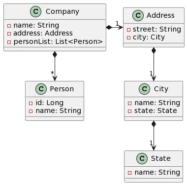

Back to [Index](0-index.md)
# Stream
## Java 8 - Stream
We can use Java Stream API to implement internal iteration, that is better because java framework is in control of the iteration.
In essence streams are 
- wrappers around a data source, 
- allowing us to operate with that source, 
- -it does NOT store the data and 
- it NEVER modifies the data.
- 
Streams operate on Collections (List<Integer>) and Arrays (int[])

```java
List<String> cars = new ArrayList<String>();
cars.add("Volvo"); cars.add("Audi"); cars.set(0, "BMW"); // directly prints [BMW, Audi]

// Streams
ArrayList<String> carArray = cars.stream().collect(Collectors.toCollection(ArrayList::new));
carArray.add("Ford");

List<String> carList = cars.stream().collect(Collectors.toList()); // provides ArrayList for List
carList.add("Ford");

List<String> carListImmutable = cars.stream().toList(); // provides List
//carListImmutable.add("Ford"); // gives Exception java.lang.UnsupportedOperationException
```

Prior to Java 8, the approach to do it would be:
```java
private static int sumIterator(List<Integer> list) {
    Iterator<Integer> it = list.iterator();
    int sum = 0;
    while (it.hasNext()) {
        int num = it.next();
        if (num > 10) {
            sum += num;
        }
    }
    return sum;
}
```
There are three major problems with the above approach:
- We just want to know the sum of integers but we would also have to provide how the iteration will take place, this is also called external iteration because client program is handling the algorithm to iterate over the list.
- The program is sequential in nature, there is no way we can do this in parallel easily.
- There is a lot of code to do even a simple task.

```java
private static int sumStream(List<Integer> list) {
    return list.stream()
            .filter(i -> i > 10)
            .mapToInt(i -> i)
            .sum();
}
 ```
Stream.of() needs flattening whereas Arrays.stream() does not.
- Stream.of() is generic whereas 
- Arrays.stream is not: Arrays.stream() method only works for primitive arrays of int[], long[], and double[] type, and returns IntStream, LongStream and DoubleStream respectively. 

For other primitive types, Arrays.stream() won’t work. On the other hand, Stream.of() returns a generic Stream of type T (Stream). Hence, it can be used with any type.

### Example

The following code get the city name of the companies addresses:
```java
public List<String> getCityNames(List<Company> companyList){
return companyList.stream()
    .map(company -> company.getAddress().getCity().getName())
    .toList();
}
```
Can be replaced by this to be more readable:
```java
public List<String> getCityNames(List<Company> companyList){
return companyList.stream()
    .map(Company::getAddress)
    .map(Address::getCity)
    .map(City::getName)
    .toList();
}
```
Null checks - The code above with null checks:
```java
public List<String> getCityNames(List<Company> companyList){
return companyList.stream()
    .map(Company::getAddress)
    .filter(Objects::nonNull)
    .map(Address::getCity)
    .filter(Objects::nonNull)
    .map(City::getName)
    .filter(Objects::nonNull)
    .toList();
}
```
### Gets all Persons from all Companies 
```java
class Company {
    private String name;
    private Address address;
    private List<Person> personList;
    
public List<Person> getAllPerson(List<Company> companyList){
  // Make a list of list of Person
  List<List<Person>> partialResult = companyList.stream()
    .map(Company::getPersonList)
    .toList();

  // For each list of Person, add to the result
  List<Person> result = new ArrayList<>();
  partialResult.forEach(result::addAll);

  return result;
}
```
Shorter code with flatmap
```java
public List<Person> getAllPerson(List<Company> companyList){
return companyList.stream()
    .map(Company::getPersonList) // It returns a Stream<List<Person>>
    .flatMap(List::stream)  // It returns a Stream<Person>
    .toList();
}
```
### returns a Map with a List of Company of each city
```java
public Map<City,List<Company>> getCompaniesByCity(List<Company> companyList){
    return companyList.stream()
            .collect(Collectors.groupingBy(company -> company.getAddress().getCity()));
}
```
###  check if there is a company in some city
```java
public boolean hasCompanyInCity(List<Company> companyList, String cityName){
    return companyList.stream()
            .map(Company::getAddress)
            .map(Address::getName)
            .anyMatch(cityName::equals);
    //      .noneMatch(cityName::equals);
}
```
### Use the peek method of write a log for each city
```java
public List<String> getCityNames(List<Company> companyList){
    return companyList.stream()
            .map(Company::getAddress)
            .map(Address::getCity)
            .map(City::getName)
    //      .distinct() get unique city names        
            .peek(cityName -> log.warn(cityName))
            .toList();
}
```

## Stream concepts
# Method Chaining
With streams, you can put many operations together in a chain.
```java
List<String> words = Arrays.asList("apple", "banana", "cat", "dog");

long count = words.stream()         // Make a stream
.filter(word -> word.length() > 3)  // Filter out short words
.map(String::toUpperCase)           // Convert remaining words to uppercase
.count();                           // Count how many words are left
```
It’s like a conveyor belt for your data, where each step does something different to it (hence the title picture of this tutorial).
#Lazy Evaluation
Nothing happens in a stream until you need the result. Each step in the stream only happens when it’s needed, saving time and resources.
```java
List<Integer> numbers = Arrays.asList(5, 12, 8, 3, 15, 20);

Integer result = numbers.stream()
.filter(n -> n % 2 == 0) // Only even numbers
.filter(n -> n > 10)     // Only numbers greater than 10
.findFirst()              // Find the first matching number
.orElse(null);            // Return null if no match
```
The filtering is not performed immediately. Instead, it sets up the condition for filtering but waits until the stream is consumed or a terminal operation is applied.

# Parallel Processing
Streams can automatically use multiple threads to do work faster.
```java
List<Integer> numbers = Arrays.asList(1, 2, 3, 4, 5, 6, 7, 8, 9, 10);

int sum = numbers.parallelStream() // Process in parallel
.mapToInt(n -> n)                  // Convert to IntStream
.sum();                            // Add up all the numbers
```
This can significantly improve performance for operations that can be parallelized, such as mapping, filtering, and reducing (but be careful about which operations you decide to parallelize not to corrupt the results).

# Immutable Data
Once you make a stream, you can’t change it.
```java
List<String> names = Arrays.asList("Alice", "Bob", "Charlie");

List<String> upperCaseNames = names.stream() // Make a stream
.map(String::toUpperCase)                    // Make all names uppercase
.collect(Collectors.toList());               // Collect into a new list
```
Each operation on the stream makes a new stream. This helps to keep your data safe and makes it easier to understand your code.

# Optional
Streams often work hand-in-hand with Optional to handle potentially absent values.
```java
Optional<String> firstFruit = fruits.stream() // Make a stream
.findFirst();                                 // Find the first fruit
```
findFirst operation returns an Optional containing the first element of the stream, or an empty Optional if the stream is empty. This helps us gracefully handle the null values.


