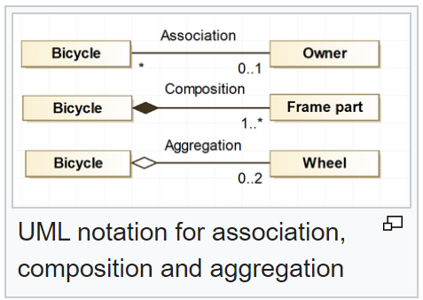
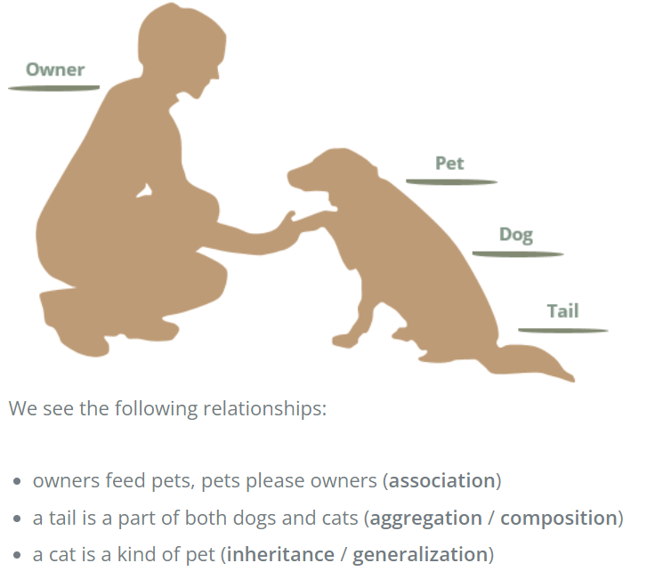
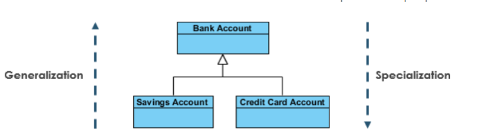
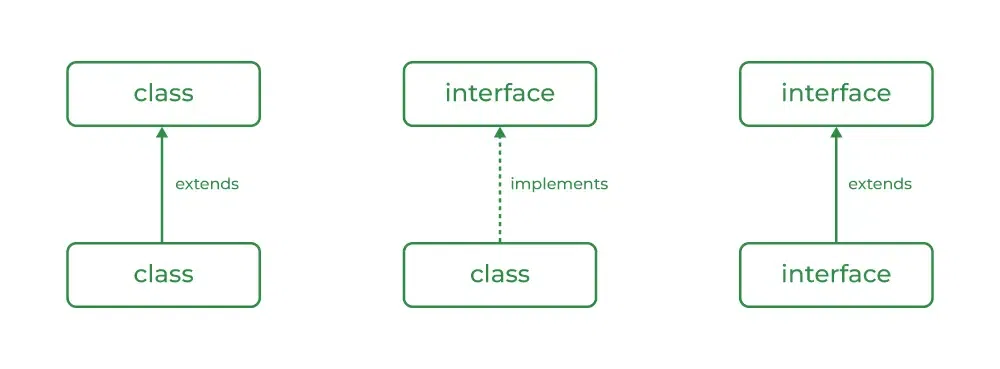

Back to [Index](../7-Java8-Coding-examples/0-index.md)

# OOP
OOP is not merely a programming paradigm; it is a methodology with many different applications that emphasizes the creation of reusable, organized, and efficient software systems.
The main principles of OOPs in Java are 
1. encapsulation, 
2. inheritance, 
3. polymorphism, and 
4. abstraction

### OOP - Association, composition and aggregation



https://www.visual-paradigm.com/guide/uml-unified-modeling-language/uml-aggregation-vs-composition/


We see the following relationships:
* owners feed pets, pets please owners (association)
* a tail is a part of both dogs and cats (aggregation / composition)
* a cat is a kind of pet (inheritance / generalization)

```java
public class House {
    
  // specific cas of weak association (has / uses) - no lifetime ownership
  private Owner owner; // Aggregation - is independent
    
  // specific case of strong association - lifetime ownership (whole / part)
  private List<Room> rooms; // Composition - is dependent/essential

}
```

### OOP - Generalization and Specialization - Inheritance
Generalization and inheritance are the same. The terminology just differs depending on the context where it is being used.

* Specialization is the reverse process of Generalization means creating new sub-classes from an existing class.
* Generalization is a mechanism for combining similar classes of objects into a single, more general class.



#### abstract class
- a class that cannot be instantiated on its own 
- serves as a foundation for other classes to be derived from
- share common attributes and behaviors / methods that MUST be overridden.

Different Ways to Prevent Method Overriding in Java
1. Using a static method
2. Using private access modifier
3. Using default access modifier
4. Using the final keyword method

```java
class Base {
public static void hello() { System.out.println("Base"); }
}

class Child extends Base {
public static void hello() { System.out.println("Child"); }
}

// Base base = new Child();
// base.hello(); // prints Base as its methods have static binding

// make hello in base private
// Child child = new Child();
// child.hello(); // prints Child

// delete public in hello child / base keeps private
// Child child = new Child();
// child.hello(); // gives compile error in base

// make hello in base final / child no modief
// Child child = new Child();
// child.hello(); // gives compile error with child hello method
```

#### parent class
* can be instantiated on its own
* may serve as a foundation for other classes to be derived from
* owns common attributes and behaviors / methods that DO NOT NEED to be overridden.

#### interface class
* Like abstract classes, interfaces cannot be used to create objects 
* Interface methods do not have a body - the body is provided by the "implement" class
* On implementation of an interface, you must override all of its methods
* Interface methods are by default abstract and public
* Interface attributes are by default public, static and final
* An interface cannot contain a constructor (as it cannot be used to create objects)

Why And When To Use Interfaces?
1. To achieve security - hide certain details and only show the important details of an object (interface).
2. Java does not support "multiple inheritance" (a class can only inherit from one superclass). However, it can be achieved with interfaces, because the class can implement multiple interfaces. Note: To implement multiple interfaces, separate them with a comma (see example below).


Inheritance | When to use
- | -
Interface | when defining the public API of a certain type - when there is no inherent "is-a" relationship
Abstract Class | when there is an "is-a" relationship between the base class and its subclasses - the parent has constructors, state, and behavior.
Parent Class | It is useful for code reusability: reuse attributes and methods of an existing class when you create a new class.

```java
// Funda example

public interface Sellable {
    
    double getPrice(); // FORCE override as its by default abstract
        
    //default method
    default void printDescription() {
      System.out.println("House description");
    }
}
public abstract class House {
    
  // static method - BLOCK override when final / private
  // when overridden its method hiding
  static boolean isEnergyEfficient(String energyLabel) {
    if (energyLabel.equals("A")) return true;
    return false;
  }
}

public class ResidentialBuilding extends House implements Sellable {

  @Override
  public double getPrice() {
    return 100_000;
  }
}
public class Land implements Sellable {

  @Override
  public double getPrice() {
    return 50_000;
  }
}
```



### OOP - Generalization and Specialization - Inheritance