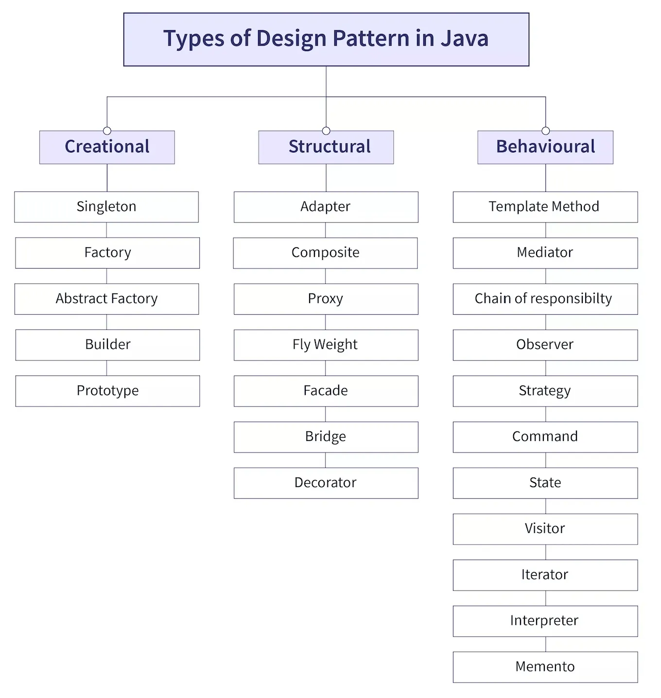

Back - [Java index](0-index.md)

# Overview


**Gangs of Four (GoF) Design Patterns**
This book was first published in 1994 and it’s one of the most popular books to learn design patterns. The book was authored by Erich Gamma, Richard Helm, Ralph Johnson, and John Vlissides. It got nicknamed as Gangs of Four design patterns because of four authors. Furthermore, it got a shorter name as “GoF Design Patterns”.

Patterns always have two parts: the how and the when. Not just do you need to know how to implement them, you also have to know when to use them and when to leave them alone.

## solid
The SOLID design principles help us create maintainable, reusable, and flexible software designs. Each letter in the acronym SOLID stands for a specific principle.
Here is what each letter in the acronym stands for:
S: Single responsibility principle.
O: Open–closed principle.
L: Liskov substitution principle.
I: Interface segregation principle.
D: Dependency inversion principle.

So to follow the 
- single responsibility principle (SRP) and 
- the open-close principle (OCP)

## SPR
The Single Responsibility Principle (SRP) is the concept that any single object in object-oriented programing (OOP) should be made for one specific function. SRP is part of SOLID programming principles put forth by Robert Martin. Traditionally, code that is in keeping with SRP has a single function per class.
The idea behind the SRP is that every class, module, or function in a program should have one responsibility/purpose in a program. As a commonly used definition, "every class should have only one reason to change".

```java
public class Student {
     public void registerStudent() {
         // some logic
     }
     public void calculate_Student_Results() {
         // some logic
     }
     public void sendEmail() {
         // some logic
     }
}
```
This Student class has three responsibilities – registering students, calculating their results, and sending out emails to students.
We cannot make this code reusable for other classes or objects. The class has a whole lot of logic interconnected that we would have a hard time fixing errors. And as the codebase grows, so does the logic, making it even harder to understand what is going on.

```java
public class StudentRegister {
    public void registerStudent() {
        // some logic
    }
}
public class StudentResult {
    public void calculate_Student_Result() {
        // some logic
    }
}
```
Now that we have separated the logic, our code is easier to understand as each core functionality has its own class. We can test for errors more efficiently.


## OCP
The open-closed principle states that software entities should be open for extension, but closed for modification.
This implies that such entities – classes, functions, and so on – should be created in a way that their core functionalities can be extended to other entities without altering the initial entity's source code.

```java
public class Human  {
    public int height;
    public int weight;

}
public class CalculateBMI {
    public int CALCULATE_JOHN_BMI(Human John) {
        return John.height/John.weight;
    }
}
```
The problem with this is that we keep modifying the code every time we need to calculate the BMI of another person.
This also violates the SRP because the class now has more than one reason to change.
Although the code above may work perfectly, it's not efficient. We modify the code constantly which may lead to bugs. And the code only has provision for humans. What if we have to calculate for an animal or an object?

```java
public interface Entity {
    public int CalculateBMI();
}

// John entity
public class John implements Entity {
    int height;
    int weight;
    public double CalculateBMI() {
        return John.height/John.weight;
    }
}
```

## DIP
Dependency Inversion Principle (DIP)
The dependency inversion principle states:

High-level modules should not import anything from low-level modules. Both should depend on abstractions (e.g., interfaces). (Source: Wikipedia).
**And,**
Abstractions should not depend on details. Details (concrete implementations) should depend on abstractions. (Source: Wikipedia).
Let's use a real-life example before writing some code.

Imagine taking a one minute walk to the bank every time you had to withdraw money over the counter. It then takes an extra thirty seconds for you get your money. This is quite efficient because very little time is wasted. We'll assume you're the high-level module and the bank is the low-level module.
But what happens when the bank is closed for a holiday or an emergency? You have absolutely no access to your funds. If you move further away from the bank, it becomes a bigger problem because you'd spend more time getting there.
To solve this problem, an interface is introduced – an automated teller machine (ATM) or a mobile banking app. Even though you have a relationship with the bank, you are no longer required to interact with them physically to be served.

VIOLATE DIP 
```java
public class Bank {

    public void GIVE_CUSTOMER_MONEY_OTC() {
        // some logic
    }
}
public class Customer {
    private Bank myBank = new Bank();

    public void withdraw() {
        myBank.GIVE_CUSTOMER_MONEY_OTC();
    }
}
```

SOLUTION
```java
public interface ATM {
    void ATM_OPERATION();
}
// Here's the Bank class which uses a method in the ATM interface to add money to the ATM:
public class Bank implements ATM {
    @Override
    ATM_OPERATION(){
        // code to add money to ATM and increase the ATM balance
    }
}
// Lastly, the Customer class which uses the same interface to withdraw money:
public class Customer implements ATM {
    @Override
    ATM_OPERATION(){
        // code to withdraw money from ATM and decrease the ATM balance
    }
}
```

## OOP
What Is Object Oriented Design?
Object oriented design is a design methodology for building object-based systems and applications. This enables us to build systems with a collection of objects where each object has its own properties and methods.

Take the computer system as an example. Its hardware is made up of different parts that comprise the whole system.

Here are some of the general terms associated with object oriented design:

principe | desc
- | -
Objects | Each separate unit that makes up the system is an object. Objects can have properties and methods.
Classes | Classes act as a general description for objects. So an object is an instance of a class.
Encapsulation | this aids in bundling all the relevant data of an object in one unit. This also helps in restricting access to specific data and methods which should only be found in one object.
Inheritance | Inheritance makes it easier for us to extend the functionality of a class to other classes.  This way, we do not repeat the process of creating these functionalities over and over again.
Abstraction | This means showing only important attributes and hiding the irrelevant ones.
Polymorphism | This is the existence of an interface in various forms. The ability to extend an object/interface but with different or addition attributes.


