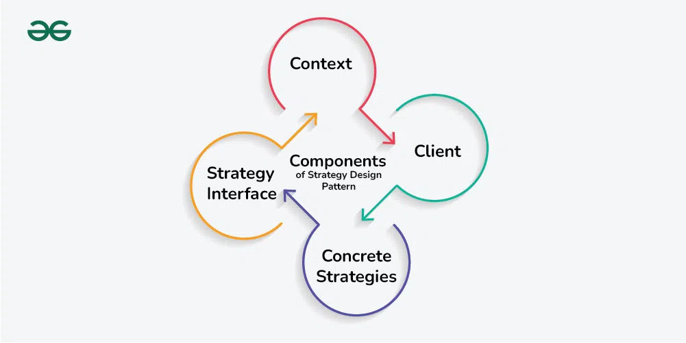

Back - [Java index](0-index.md)

## Behavioral Design Patterns

Pattern Name | Description
- | - 
Template| Method	used to create a template method stub and defer some of the steps of implementation to the subclasses.
Mediator | used to provide a centralized communication medium between different objects in a system.
Chain of Responsibility | used to achieve loose coupling in software design where a request from the client is passed to a chain of objects to process them.
Observer | useful when you are interested in the state of an object and want to get notified whenever there is any change.
Strategy | Strategy pattern is used when we have multiple algorithm for a specific task and client decides the actual implementation to be used at runtime.
Command | Command Pattern is used to implement lose coupling in a request-response model.
State | State design pattern is used when an Object change it’s behavior based on it’s internal state.
Visitor | Visitor pattern is used when we have to perform an operation on a group of similar kind of Objects.
Interpreter | defines a grammatical representation for a language and provides an interpreter to deal with this grammar.
Iterator | used to provide a standard way to traverse through a group of Objects.
Memento | The memento design pattern is used when we want to save the state of an object so that we can restore later on.

### Strategy

Strategy pattern is also known as Policy Pattern. We define multiple algorithms and let client application pass the algorithm to be used as a parameter. One of the best example of strategy pattern is Collections.sort() method that takes Comparator parameter. Based on the different implementations of Comparator interfaces, the Objects are getting sorted in different ways.

**Used when**

When you have multiple algorithms that can be used interchangeably based on different contexts, such as sorting algorithms (bubble sort, merge sort, quick sort), searching algorithms, compression algorithms, etc.


```java
... // public class PaypalStrategy implements PaymentStrategy 
	public PaypalStrategy(String email, String pwd){
        this.emailId=email;
        this.password=pwd;
    }
    @Override
    public void pay(int amount) {
        System.out.println(amount + " paid using Paypal.");
    }
... // public class ShoppingCart
    public void pay(PaymentStrategy paymentMethod){
        int amount = calculateTotal();
        paymentMethod.pay(amount);
    }    
...
    
// the run is    
ShoppingCart cart = new ShoppingCart();

Item item1 = new Item("1234",10);
Item item2 = new Item("5678",40);
		
cart.addItem(item1);
cart.addItem(item2);

// pay by paypal
cart.pay(new PaypalStrategy("myemail@example.com", "mypwd"));

// pay by credit card
cart.pay(new CreditCardStrategy("Pankaj Kumar", "1234567890123456", "786", "12/15"));
```
REAL LIFE EXAMPLE

Payment Processing: In a payment processing system, different payment methods like credit cards, PayPal, or mobile wallets can be handled using the Strategy pattern. Each payment method can be represented by a separate strategy class, allowing users to select their preferred payment method at runtime. The payment context class can invoke the appropriate strategy to process the payment.

Strategy pattern is useful when we have multiple algorithms for specific task and we want our application to be flexible to chose any of the algorithm at runtime for specific task.

Another example
```java
public interface Discounter {
BigDecimal applyDiscount(BigDecimal amount);

    static Discounter christmasDiscounter() {
        return amount -> amount.multiply(BigDecimal.valueOf(0.9));
    }

    static Discounter newYearDiscounter() {
        return amount -> amount.multiply(BigDecimal.valueOf(0.8));
    }

    static Discounter easterDiscounter() {
        return amount -> amount.multiply(BigDecimal.valueOf(0.5));
    }
}
```

Another example

Characteristics of the Strategy Design Pattern?
The Strategy Design Pattern exhibits several key characteristics that make it distinctive and effective for managing algorithm variations in software systems:

* It defines a family of algorithms: The pattern allows you to encapsulate multiple algorithms or behaviors into separate classes, known as strategies.
* It encapsulates behaviors: Each strategy encapsulates a specific behavior or algorithm, providing a clean and modular way to manage different variations or implementations.
* It enables dynamic behavior switching: The pattern enables clients to switch between different strategies at runtime, allowing for flexible and dynamic behavior changes.
* It promotes object collaboration: The pattern encourages collaboration between a context object and strategy objects, where the context delegates the execution of a behavior to a strategy object.

```java
public interface Strategy {
    public int doOperation(int num1, int num2);
}

public class OperationMultiply implements Strategy{
    @Override
    public int doOperation(int num1, int num2) {
        return num1 * num2;
    }
}

public class Context {
    private Strategy strategy;

    public Context(Strategy strategy){
        this.strategy = strategy;
    }

    public int executeStrategy(int num1, int num2){
        return strategy.doOperation(num1, num2);
    }
}

public class StrategyPatternDemo {
    public static void main(String[] args) {
        Context context = new Context(new OperationAdd());
        System.out.println("10 + 5 = " + context.executeStrategy(10, 5));

        context = new Context(new OperationSubstract());
        System.out.println("10 - 5 = " + context.executeStrategy(10, 5));

        context = new Context(new OperationMultiply());
        System.out.println("10 * 5 = " + context.executeStrategy(10, 5));
    }
}
```


1. Context
The Context is a class or object that holds a reference to a strategy object and delegates the task to it.
It acts as the interface between the client and the strategy, providing a unified way to execute the task without knowing the details of how it’s done.
The Context maintains a reference to a strategy object and calls its methods to perform the task, allowing for interchangeable strategies to be used.
2. Strategy Interface
The Strategy Interface is an interface or abstract class that defines a set of methods that all concrete strategies must implement.
It serves as a contract, ensuring that all strategies adhere to the same set of rules and can be used interchangeably by the Context.
By defining a common interface, the Strategy Interface allows for decoupling between the Context and the concrete strategies, promoting flexibility and modularity in the design.
3. Concrete Strategies
Concrete Strategies are the various implementations of the Strategy Interface. Each concrete strategy provides a specific algorithm or behavior for performing the task defined by the Strategy Interface.
Concrete strategies encapsulate the details of their respective algorithms and provide a method for executing the task.
They are interchangeable and can be selected and configured by the client based on the requirements of the task.
4. Client
The Client is responsible for selecting and configuring the appropriate strategy and providing it to the Context.
It knows the requirements of the task and decides which strategy to use based on those requirements.
The client creates an instance of the desired concrete strategy and passes it to the Context, enabling the Context to use the selected strategy to perform the task.