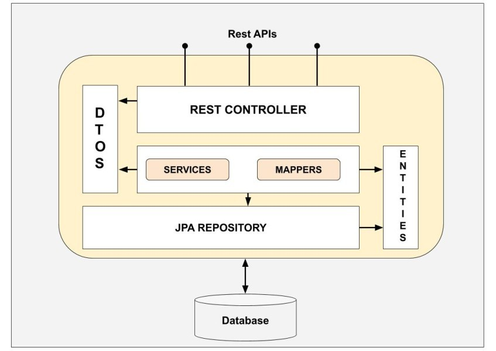

Back - [Java index](0-index.md)

## Enterprice Patterns

Source: https://martinfowler.com/eaaCatalog/

Pattern Name | Description
- | - 
Data Transfer Object | An object that carries data between processes in order to reduce the number of method 

### Data Transfer Object - alwasy needed


In Java application development, there is a clear distinction between entities and DTOs (Data Transfer Objects). Here's an overview of the differences between the two and the reasons for using DTOs instead of entities:

Entity:
* An entity represents a persistent data structure or object that is typically mapped to a database table. It represents a concept or entity in your domain model and often contains additional logic or behavior.
* Entities are closely tied to the database and are usually annotated with ORM (Object-Relational Mapping) annotations, such as JPA (Java Persistence API) annotations.
* Entities may have relationships with other entities, such as one-to-one, one-to-many, or many-to-many relationships, which can be expressed through fields or associations.
* Entities may include additional methods or behaviors for performing domain-specific operations and business rules.

DTO (Data Transfer Object):
* A DTO is a plain Java object that is used to transfer data between different layers or components of an application, often across network boundaries.
* DTOs typically represent a specific subset of an entity's data or a combination of multiple entities' data, depending on the requirements of a particular use case.
* DTOs are usually lightweight, containing only the necessary fields to transfer data, without any additional logic or behavior.
* DTOs are commonly used for communication with external systems, such as APIs or remote services, where the structure and format of the data need to be controlled and optimized.
* DTOs can help decouple the internal data representation (entities) from the external interfaces, allowing for better versioning, flexibility, and performance optimization.
* DTOs can also be used to aggregate data from multiple entities, eliminating the need for multiple round-trips to retrieve data from different sources.



The use of DTOs instead of entities offers several advantages:

1. Data Encapsulation: DTOs allow you to control the data that is exposed externally, ensuring that only the necessary information is transferred, enhancing data encapsulation and security.
2. Performance Optimization: DTOs can help optimize performance by reducing the amount of data transferred between different layers or components, minimizing payload size, and improving network efficiency.
3. Security and Privacy: By using DTOs, you can selectively expose and filter the data, preventing sensitive information or implementation details from being leaked to external systems.
4. Versioning and Compatibility: DTOs provide flexibility in evolving your entities without affecting external contracts, allowing for better backward compatibility and smooth transitions.
5. Mapping and Integration: DTOs provide a convenient way to map data between different layers, simplifying data conversion and integration tasks.
6. Domain and Presentation Separation: DTOs help maintain a clear separation between the domain model (entities) and the presentation layer, promoting better architectural practices and modular design.

7. Overall, using DTOs instead of exposing entities directly enhances data encapsulation, security, performance, flexibility, and maintainability in Java applications, especially when dealing with communication between different layers or external systems.

Some people argue for them as part of a Service Layer API because they ensure that service layer clients aren't dependent upon an underlying Domain Model. 
While that may be handy, I don't think it's worth the cost of all of that data mapping. As my contributor Randy Stafford says in P of EAA "Don't underestimate the cost of [using DTOs].... It's significant, and it's painful

```java
public class Singleton {
    // has static ref for itself
    private static Singleton instance;
    private Singleton() {}
    // has static method of creating instance since constructor is private
    public static Singleton instance() {
        if (instance == null) {
            instance = new Singleton();
        }
        return instance;
    }
}
```
